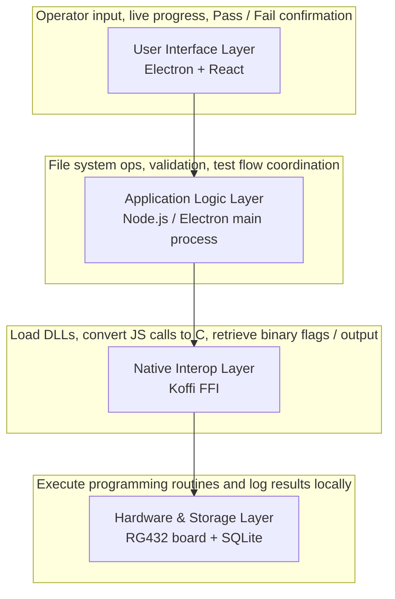

# Project Initiation Document: RG432 Automated Test Rig

| Field | Value |
|-------|-------|
| Project Name | RG432 Automated Test Rig |
| Developer | Greg (Level 4 Software Developer Apprentice) |
| Stakeholder / Product Owner | Jeff |
| Document Date | 29 June 2026 |
| Status | Draft — pending stakeholder approval |
| Project Start Date | Friday 3 July 2026 |
| Project End Date | Friday 28 August 2026 |
| Sprint Count | 4 two-week sprints (8 weeks total) |
| Development Methodology | Agile, Kanban, two-week sprints, Fibonacci story-point estimation |

---

## 1. Executive Summary

The RG432 Automated Test Rig is a Windows desktop application that will program, verify, and log every RG432 audio conversion board before it leaves the factory. The application will provide a simple operator interface, coordinate with product-specific DLLs via a native FFI layer, and store all test results in a local SQLite database. The primary goal is to eliminate expensive customer returns by ensuring each unit is fully tested and traceable.

This project is being undertaken as part of a Level 4 Software Developer apprenticeship. It covers the full Software Development Life-Cycle (SDLC), including user interface design, native library integration, database management, and thorough system testing.

---

## 2. Project Timeline & Methodology

The project runs from **Friday 3 July 2026** to **Friday 28 August 2026**, split into **4 two-week sprints**. It will follow an Agile methodology using Kanban. This approach is chosen because hardware-linked software development is iterative: DLL interfaces, hardware behaviours, and test specifications may change during the build. Agile allows the plan to pivot without derailing the overall timeline.

### Kanban / Sprint Cadence
- Two-week sprints.
- Sprint planning, daily progress notes, and a sprint retrospective for each sprint. (Greg is the sole developer; ceremonies are run solo with Jeff as stakeholder.)
- Tasks tracked transparently on a Trello board shared with Jeff.
- Definition of Done: code self-reviewed, tested, documented, and merged to the main branch.

### Estimation
All backlog items will be estimated using the Fibonacci sequence (1, 2, 3, 5, 8, 13, 21). Each point represents an approximate half-day of focused development effort. Items larger than 13 points must be broken down before acceptance into a sprint.

### Typical Two-Week Sprint Structure
| Day | Activity |
|-----|----------|
| Day 1 | Sprint planning — select backlog items, agree acceptance criteria, estimate tasks. |
| Day 2 | Environment setup and first task kickoff. |
| Day 3–4 | Core development and daily progress notes. |
| Day 5 | Mid-sprint review — demo progress, adjust plan if needed. |
| Day 6–8 | Core development, unit tests, and integration tests. |
| Day 9 | Regression test, documentation update, and merge preparation. |
| Day 10 | Sprint review with Jeff, retrospective, and backlog refinement for next sprint. |

### Agile vs Waterfall
Agile is preferred over Waterfall for this project because the hardware and DLL specifications are likely to evolve. Waterfall would lock requirements too early and make mid-project changes costly. Agile's iterative nature keeps the project responsive while still delivering a fixed end date.

### Detailed Sprint Plan
For the complete day-by-day sprint breakdown, Fibonacci point allocations, ceremonies, and Definition of Done, see `AGILE_SDLC_STRATEGY.md`.

---

## 3. Stakeholders & Roles

| Role | Person | Responsibilities |
|------|--------|------------------|
| Developer | Greg | Own the full SDLC: UI design, application logic, DLL integration, database design, testing framework, CI/CD, documentation, and UAT support. |
| Stakeholder | Jeff | Provide a demo DLL for early integration work and synthesised test files; supply the final DLL when ready; supply physical prototype units for final integration testing; provide UAT sign-off. |
| End Users | Factory operators | Use the application on the production line to program, verify, and log each RG432 board. |

---

## 4. Objectives & Success Criteria

### Project Objectives
1. Build a simple, reliable Windows desktop application for factory operators.
2. Allow operators to register each board (serial number, operator, timestamp, etc.).
3. Trigger board programming and verification through product DLLs via Koffi.
4. Record every test outcome in a local SQLite database with full traceability.
5. Provide a clear Pass / Fail result to the operator.
6. Support development without hardware via a built-in simulation/mock mode.
7. Export diagnostic logs automatically when unexpected failures occur.
8. Package the final application as a standalone Windows executable for UAT.

### Success Criteria
- The application can be installed and run on a standard Windows PC without additional server infrastructure.
- An operator can register a board, start a test, and receive an unambiguous Pass / Fail result within a defined cycle time.
- Every completed test is persisted in SQLite with board serial number, operator, timestamp, result, and any diagnostic output.
- The application can operate in simulation mode so development can continue before hardware or final DLLs are available.
- On unexpected failure, a diagnostic log file is exported automatically for offline analysis.
- The final build passes Jeff's UAT and is signed off as ready for factory deployment.

### Additional Technical Proposals
- **Simulation / Mock Mode Toggle**: A built-in mode that simulates hardware and DLL responses using controlled test data, removing the dependency on physical hardware during development and allowing automated tests to run in CI.
- **Automated Diagnostic Log Export**: On any unexpected test failure, the application will write a timestamped diagnostic log file (board details, environment info, returned error flags, and stack trace). Factory staff can send this log to engineering for rapid fault diagnosis, supporting continuous improvement.

---

## 5. Product Context (Brief)

### What the RG432 Is
The RG432 is a small, USB-powered, metal-cased stereo audio conversion device. It takes standard audio tuned to the 440Hz reference scale and rescales it to the 432Hz reference scale. The product is aimed at Hi-Fi users and anyone who wants to experience audio tuned to the 432Hz scale.

### Core Technical Function
The device performs real-time frequency conversion using a proprietary algorithm. The marketing specification describes a process based on Fourier Transform analysis and a 55:54 scaling ratio, returning the audio to a listenable waveform without artificially slowing the track or introducing pitch-shift distortion. The product also includes an analysis feature that prevents a track from being converted twice if it is already in 432Hz.

### Business Value
The RG432 is intended for volume manufacture (thousands of units). The automated test rig is therefore business-critical: it must guarantee that every unit is correctly programmed, functionally verified, and logged before shipment, minimising the cost and reputational damage of customer returns.

### Approved Product Direction
Jeff has approved the following recommendation. It is not part of the test rig build scope, but it is confirmed as a product-level direction:
- **Marketing the Analysis Feature**: Promote the built-in analysis that detects whether a track is already in 432Hz and prevents it from being converted twice.

---

## 6. Tech Stack

| Layer | Technology | Justification |
|-------|------------|---------------|
| Desktop framework | Electron + React + Vite + TypeScript | Type-safe, modern desktop GUI with fast Vite builds and proven tooling. |
| Native interoperability | Koffi (Node.js C FFI) | Modern, fast, and memory-safe FFI for loading and invoking C-based DLLs from Node.js. |
| Local database | SQLite via better-sqlite3 | Serverless, lightweight, and ideal for a standalone factory test rig; better-sqlite3 provides a synchronous, high-performance Node.js binding. |
| Language | TypeScript | Static typing across the Electron main process, renderer, and shared modules. |
| Linting | ESLint | Enforced code style and caught common defects across the codebase. |
| Version control | Git + GitHub | Standard source control, collaboration, and issue tracking. |
| Commit standards | Conventional Commits + commitlint | Automated commit-message linting to keep the history readable and changelog-friendly. |
| CI/CD | GitHub Actions | Automated linting, type checking, unit tests, and Windows installer build on every push; sprint-end release workflow generates changelog, tag, and GitHub Release on manual trigger. |
| Testing | Vitest + Playwright | Vitest for unit and integration tests; Playwright for end-to-end UI tests. |
| Documentation | Markdown in repository | ADRs, sprint retrospectives, and test plans kept alongside the code. |
| Code documentation | JSDoc | Standardised inline documentation for modules, functions, and native interop interfaces. |
| Diagrams | Mermaid | Architecture and workflow diagrams embedded directly in Markdown under version control. |

---

## 7. Architecture Overview

The application is organised into a clean four-tier pipeline:

### Key Flow
1. Operator enters board details.
2. Application validates input and writes to the database as a pending test.
3. Application (or mock simulator) invokes DLL functions to program and verify the board.
4. Result is parsed and stored in the database.
5. UI shows Pass / Fail and, on failure, exports a diagnostic log.

---

## 8. Sprint Plan

| Sprint | Dates | Focus | Key Deliverables |
|--------|-------|-------|------------------|
| Sprint 1 | 3 Jul – 16 Jul | Environment & UI Setup | GitHub repository, Electron + Vite + TypeScript scaffold, ESLint, Vitest, Conventional Commits, React UI forms for board registration and test initiation. |
| Sprint 2 | 17 Jul – 30 Jul | Database & Simulation Layer | SQLite schema, seed data, mock mode toggle, and dummy hardware responses. |
| Sprint 3 | 31 Jul – 13 Aug | Native DLL Integration & File Analysis | Koffi integration, early-stage DLL loading, command passing, binary flag parsing, and processing of output files. |
| Sprint 4 | 14 Aug – 28 Aug | Logging, Physical Integration & UAT | Persist results, generate batch reports, diagnostic log export, physical prototype testing, UAT scripts, Windows installer, and stakeholder sign-off. |

### Contingency
Sprints 3 and 4 carry the highest risk because they depend on external artefacts (DLLs, hardware, and Jeff's potential testing EXE). A demo DLL will be available from Jeff for early integration, but the final DLL may arrive later. Buffer tasks are included in each sprint so that earlier work can be hardened if the final DLL or other dependencies are delayed.

---

## 9. Risk Register

| ID | Risk | Likelihood | Impact | Mitigation |
|----|------|------------|--------|------------|
| R1 | Final DLLs or hardware arrive late | Medium | High | Mock mode and the demo DLL from Jeff let development continue without the final DLL or hardware. |
| R2 | DLL interface changes mid-project | Medium | High | Isolate Koffi calls behind a native interop module; document the interface with ADRs. |
| R3 | Factory PCs have restricted IT policies | Medium | Medium | Build a standalone executable; avoid external services and admin requirements. |
| R4 | SQLite database corruption on production line | Low | High | Use WAL mode, regular backups, and a simple export/audit function. |
| R5 | Apprenticeship evidence not captured | Low | High | Maintain KSB mapping, ADRs, and retrospectives as the project progresses. |
| R6 | Jeff supplies an alternative testing EXE or a demo DLL that differs from the final one | Medium | Medium | Design the native interop layer so it can swap between the project DLL, the demo DLL, a mock, or an external testing EXE with minimal change. |

---

## 10. Security & Data Protection

The application will handle manufacturing data, including board serial numbers and operator names. The following safeguards will be applied across the application, data, and deployment layers.

### Application Security
- **Context isolation**: Electron will run the renderer and preload scripts in isolated JavaScript contexts, preventing untrusted UI code from accessing Node.js APIs directly.
- **Sandbox mode**: The renderer process will be sandboxed to further restrict access to the operating system and Node.js.
- **IPC bridge**: All communication between the renderer and the main process will go through a controlled preload script IPC bridge with an explicit allowlist of permitted actions.
- **Content Security Policy (CSP)**: A strict CSP will be applied to prevent inline scripts, eval, and remote resource loading.
- **No hardcoded secrets or DLL paths**: API keys, credentials, proprietary configuration, and DLL paths will be loaded from environment variables or a secure configuration file, not embedded in source code.
- **Input validation**: All operator input will be validated and sanitised to prevent injection attacks or database corruption.

### Data Protection
- **Local storage only**: All data is stored in a local SQLite file on the factory PC. No data is transmitted to external services or cloud platforms unless explicitly required.
- **Personal data**: Operator names are personal data under GDPR. They will only be collected when necessary for traceability, stored securely, and retained only for the required period.
- **Data retention**: Test records will be retained in line with company policy and any regulatory requirements. A simple export and purge function will be provided if needed.
- **Parameterised queries**: SQLite will use parameterised queries to prevent SQL injection when storing or retrieving board records.
- **Access control**: The application runs on the factory PC under the operator's standard Windows account. The database file will be stored in a protected application directory.
- **Audit trail**: Every test record includes a timestamp, operator, and board serial number to support manufacturing traceability and compliance.

### Build and Deployment Security
- **Windows code signing**: The final installer and executable will be code-signed to prevent tampering and to avoid Windows SmartScreen warnings.
- **Secure development**: Code will be reviewed through pull requests, linted, and tested in CI before merging to the main branch.

---

## 11. Supporting Practices

The following practices will be adopted alongside the core build to keep the project solid and easy to assess:

- **Architecture Decision Records (ADRs)** — Short, numbered markdown records in `docs/adr/` for every major technology or design choice.
- **Lightweight CI/CD** — GitHub Actions workflow for lint, typecheck, test, and Windows build on every push.
- **Sprint-end Releases** — A manually triggered release workflow runs `commit-and-tag-version`, which reads Conventional Commits, bumps `package.json`, updates `CHANGELOG.md`, creates a git tag, and publishes a GitHub Release at the end of each two-week sprint.
- **Sprint Retrospectives** — Captured in `docs/retrospectives/` after each sprint.
- **Test Strategy** — Separate document defining unit, integration, mock, and UAT layers.
- **Requirements Traceability** — Link features, tests, and KSBs in the project documentation.
- **Agile SDLC Strategy** — Detailed sprint plan, daily tasks, Fibonacci estimation, and ceremonies captured in `AGILE_SDLC_STRATEGY.md`.

---

## 12. KSB Traceability Matrix

The following table maps every Level 4 Software Developer Knowledge, Skill, and Behaviour to the project activity or artefact that will evidence it.

### Skills

| KSB | Description | Evidence in This Project |
|-----|-------------|--------------------------|
| S1 | Create logical and maintainable code | TypeScript, ESLint, modular architecture, and clean code practices across the codebase. |
| S2 | Develop effective user interfaces | Electron + React GUI designed for factory operators with clear Pass / Fail feedback and live progress. |
| S3 | Link code to data sets | SQLite integration for board registration, test records, and batch reports. |
| S4 | Test code and analyse results to correct errors using unit testing | Vitest unit tests with coverage analysis and defect correction. |
| S5 | Conduct a range of test types (Integration, System, UAT, Non-Functional, Performance, Security) | Integration tests with Koffi and SQLite; system tests; UAT with Jeff; non-functional testing of reliability and usability; performance testing of the test cycle time; security review of data handling. |
| S6 | Identify and create test scenarios | Test strategy document and Trello backlog test cases covering board registration, DLL success/failure, and database persistence. |
| S7 | Apply structured techniques to problem solving, debug code and understand the structure of programmes | Risk register, diagnostic logging, structured debugging process, and modular code design. |
| S8 | Create simple software designs to effectively communicate understanding of the program | Four-tier architecture diagram, ADRs, and system-flow documentation. |
| S9 | Create analysis artefacts, such as use cases and/or user stories | Personas, user stories, and use cases captured in `docs/requirements/` and the Trello backlog. |
| S10 | Build, manage and deploy code into the relevant environment | GitHub Actions CI/CD pipeline and Windows installer packaging for factory deployment. |
| S11 | Apply an appropriate software development approach according to the relevant paradigm | Agile/Kanban methodology and object-oriented/event-driven design in React/Electron. |
| S12 | Follow software designs and functional or technical specifications | Implementation follows the product brief, DLL interface specifications, and UI designs. |
| S13 | Follow testing frameworks and methodologies | Vitest, Playwright, and the project test strategy. |
| S14 | Follow company, team or client approaches to continuous integration, version and source control | Git + GitHub, Conventional Commits, commitlint, and GitHub Actions, applied as a solo developer. |
| S15 | Communicate software solutions and ideas to technical and non-technical stakeholders | This PID, stakeholder emails, Trello board, sprint reviews, and UAT demos. |
| S16 | Apply algorithms, logic and data structures | Database schema design, validation algorithms, and data structures for managing test records and queues. |
| S17 | Interpret and implement a given design whilst remaining compliant with security and maintainability requirements | Implementation of the product specification with maintainable code and the Security & Data Protection controls in this document. |

### Knowledge

| KSB | Description | Evidence in This Project |
|-----|-------------|--------------------------|
| K1 | All stages of the software development life-cycle | This PID covers the full lifecycle from requirements and design through implementation, testing, deployment, and UAT. |
| K2 | Roles and responsibilities within the software development lifecycle | Stakeholders & Roles section of this PID. |
| K3 | The roles and responsibilities of the project life-cycle within your organisation, and your role | Greg's role as sole developer and Jeff's role as stakeholder are defined in this PID. |
| K4 | How best to communicate using different communication methods and adapt to different audiences | PID for technical and non-technical stakeholders, emails to Jeff, Trello board for task tracking, and sprint demos. |
| K5 | The similarities and differences between different software development methodologies, such as agile and waterfall | Agile vs Waterfall explanation in Section 2. |
| K6 | How teams work effectively to produce software and how to contribute appropriately | Working as a solo developer while collaborating with the stakeholder (Jeff), maintaining a shared Trello board, and running sprint reviews. |
| K7 | Software design approaches and patterns, to identify reusable solutions to commonly occurring problems | Four-tier architecture, separation of concerns, and ADRs. |
| K8 | Organisational policies and procedures relating to the tasks being undertaken, and when to follow them (e.g. GDPR sensitive data) | Security & Data Protection section in this PID. |
| K9 | Algorithms, logic and data structures relevant to software development | Validation logic, database queries, sorting and searching of test records, and queue management for test flow. |
| K10 | Principles and uses of relational and non-relational databases | SQLite relational database design, schema normalisation, and comparison with non-relational alternatives in ADRs. |
| K11 | Software designs and functional or technical specifications | Architecture Overview and implementation of the product brief and DLL specifications. |
| K12 | Software testing frameworks and methodologies | Vitest, Playwright, test strategy, and Agile testing practices. |

### Behaviours

| KSB | Description | Evidence in This Project |
|-----|-------------|--------------------------|
| B1 | Works independently and takes responsibility | Full SDLC ownership, risk management, and disciplined approach to delivery. |
| B2 | Applies logical thinking | Architecture decisions, risk analysis, and structured problem solving. |
| B3 | Maintains a productive, professional and secure working environment | Security & Data Protection controls, CI/CD discipline, and professional documentation. |
| B4 | Works collaboratively with a wide range of people in different roles, with a positive attitude to inclusion and diversity | Collaboration with Jeff and engagement with factory operators during UAT. |
| B5 | Acts with integrity with respect to ethical, legal and regulatory requirements, ensuring protection of personal data, safety and security | GDPR-aware data handling, secure development practices, and honest reporting of test results. |
| B6 | Shows initiative and takes responsibility for solving problems within their own remit, being resourceful when faced with a problem to solve | Mock mode proposal, diagnostic logging, and risk mitigation strategies. |
| B7 | Communicates effectively in a variety of situations to both technical and non-technical audiences | PID, stakeholder emails, sprint demos, and operator-focused UI design. |
| B8 | Shows curiosity to the business context in which the solution will be used, with an inquisitive approach to solving the problem | Product understanding, suggestion to market the Analysis Feature, and continuous improvement through diagnostic logging. |
| B9 | Committed to continued professional development | ADRs, retrospectives, adoption of new tools (Koffi, Electron, TypeScript), and ongoing learning. |

---

## 13. Next Steps & Decisions

### Approved Decisions
- **Marketing the Analysis Feature** — Approved by Jeff as a product-level direction.

### Decisions Required from Jeff
1. Are you happy to proceed with the proposed Agile/Kanban approach and four two-week sprints from 3 July to 28 August 2026?
2. Do you approve the recommended tech stack (Electron + React + Vite + TypeScript, Koffi, SQLite, Vitest, ESLint, Conventional Commits)?
3. Do you approve the two additional technical features (mock mode and diagnostic log export)?
4. Do you approve the Security & Data Protection approach for handling operator names and test records?
5. Do you have any amendments to the product understanding captured above?

### Information Needed to Start Sprint 1
- A demo DLL from Jeff (acceptable as a temporary stand-in for the final DLL) and any synthesised test files or mock files referenced in the process brief.
- Confirmed data fields for the board registration form (beyond serial number and operator name).
- Expected test cycle time and Pass/Fail criteria for each board.
- Any factory IT constraints that may affect the installer or runtime requirements.
- Whether Jeff already has a preferred testing EXE or DLL that must be integrated instead of, or alongside, the supplied synthesised files.
- Company data retention policy for manufacturing test records and operator details.

### Action
Once Jeff confirms or amends the above, the first sprint (Environment & UI Setup) can begin immediately on 3 July 2026.

---

*Document prepared by Greg. Pending stakeholder review and approval.*
