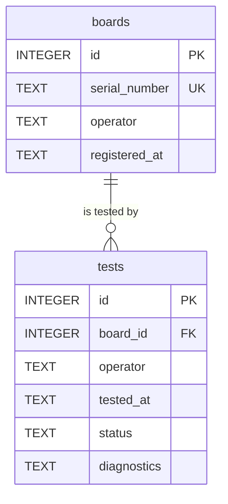

# Database Design Notes

The thinking behind the schema.
`docs/database/schema.md` is the column-level spec; this file is the *why*.
The choice of SQLite over other stores is in
[ADR 002](../adr/002-sqlite-database.md), so I will not repeat it here.

## Entity-relationship model

Two entities: a registered board, and a test event against it. One board can
be tested many times; every test must belong to exactly one board.



The cardinality matters: `1:N` from boards to tests. A serial number is the
natural key in the real world, but I still use a surrogate `id` as the
primary key — serials are user input, and if Jeff's serial format ever
changes (say a plant prefix gets added) the tests table never has to be
re-keyed.

## Normalisation

The schema is small, but it still pays to walk the forms explicitly:

- **1NF (atomic values):** every column holds one value. The tempting
  violation would be storing the four measurement bytes as a list inside one
  test row — instead they live inside the `diagnostics` string as the raw
  artefact record, which is genuinely one blob of diagnostic text, not
  separately-queryable fields. If engineering ever needed per-byte queries,
  that would be a fourth table (`test_measurements`), not a comma list.
- **2NF (no partial dependency):** every non-key column depends on the whole
  primary key. With single-column `id` keys this is automatic, but it is why
  `operator` is *not* split out of `tests` — the operator belongs to the
  test event, not to the board.
- **3NF (no transitive dependency):** `serial_number` is stored once on
  `boards`, never repeated on `tests`. The history query joins through
  `board_id` rather than duplicating the serial into every test row — if a
  serial were ever corrected, there is exactly one place to fix.

The deliberate denormalisation I *did* make: `tests.operator` copies the
operator name at test time rather than referencing an `operators` table.
That is intentional — a test record must show who ran it *at that moment*,
not who currently owns the board. An `operators` table would add a join for
zero integrity gain here because names are free text, not entities.

## Constraints as integrity evidence

Every rule the data must obey is enforced by the database itself, not just
by application code:

| Constraint | Where | What it guarantees |
|---|---|---|
| `PRIMARY KEY AUTOINCREMENT` | both `id` columns | Every row uniquely addressable |
| `UNIQUE` on `serial_number` | `boards` | A serial maps to one board record; the re-registration flow surfaces this to the UI |
| `NOT NULL` | serial, operator, timestamps, status | No incomplete test records can be written |
| `FOREIGN KEY (board_id) REFERENCES boards(id)` | `tests` | Orphaned test rows are impossible — a test cannot exist for a board that was never registered |
| `CHECK(status IN ('pass','fail','pending'))` | `tests` | Status can only ever be a known value |

The foreign key is the important one for the product requirement: "no test
without a registration" is enforced at the storage layer, so even a bug in
the IPC handler cannot produce an untraceable result.

## Indexing

| Index | Why it exists |
|---|---|
| `serial_number` (implicit, from UNIQUE) | Every test starts with a `WHERE serial_number = ?` lookup — the index keeps that O(log n) |
| `idx_tests_board_id` (migration 003) | The history query joins `tests`→`boards` on this column; without an index the join scans every test row. Added in Sprint 4 when the data volume made it worth it |

That second index is honest trade-off evidence: the table was small enough
not to need it at first, and it was added once a real join pattern
justified it rather than indexed speculatively.

## Linking code to the dataset

The repository layer (`src/main/test-repository.ts`) is the only place SQL
lives; the IPC handlers and reports consume plain objects. The queries that
matter:

```sql
-- Registration lookup (every test run starts here)
SELECT serial_number, operator, registered_at
FROM boards WHERE serial_number = ?;

-- Persist a result, foreign key enforced
INSERT INTO tests (board_id, operator, tested_at, status, diagnostics)
VALUES (?, ?, ?, ?, ?) RETURNING id;

-- History: join back to the board for its serial
SELECT t.id, b.serial_number, t.operator, t.tested_at, t.status, t.diagnostics
FROM tests t JOIN boards b ON b.id = t.board_id
ORDER BY t.id DESC;
```

Every value is a `?` placeholder — nothing is ever string-interpolated,
which is the SQL-injection defence called out in the security checklist.
Operator aggregation for the batch report happens in `summariseTests()`
(case-insensitive), on the rows already fetched for the detail section.

## Why not a document store

Covered properly in ADR 002, but the short version: the data is inherently
relational (a test is meaningless without its board), the queries are
aggregations and joins, and integrity constraints have to be enforceable
rather than conventional. A document store would move every one of those
guarantees into application code.

## Testing and debugging evidence

- `tests/database.test.ts`, `tests/migrations.test.ts`,
  `tests/test-repository.test.ts` cover migration ordering, constraints
  and repository behaviour.
- Two real bugs lived here: case-sensitive `GROUP BY` split `greg`/`Greg`
  into separate report rows (fixed with normalisation in
  `summariseTests`), and stale rows from the early `.dat` parser had to be
  repaired in place — both are the kind of storage-layer debugging S7
  asks about.
