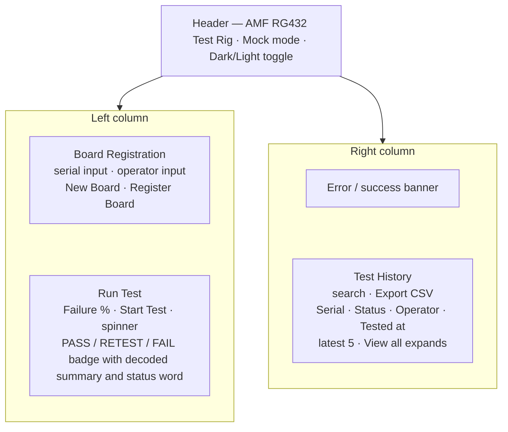

# Wireframe — Operator Interface

UI layout for the board registration and test screen, designed around the Dave
persona (factory operator — needs a simple, unambiguous interface that works in
factory conditions) and User Stories 1–4 in `docs/requirements/user-stories.md`.
Updated September 2026 to document the as-built Tailwind interface.

## Layout

Transient states not shown: the inline serial validation hint, and the
amber **Confirm Registration** state when a serial is re-registered.

## Components identified

| Component | Purpose | Traceability |
|-----------|---------|--------------|
| Mock mode switch | Switch between real DLL and simulation | User story: develop/test without hardware |
| Theme toggle | Light/dark appearance | Operator preference; factory lighting varies |
| Serial Number input | Board identifier entry/scan; pre-filled by New Board | User Story 1; Use Case 1 step 1 |
| Serial validation hint | Inline amber hint when the serial format is invalid | Use Case 1 alternative 2b |
| New Board button | Generates the next free RG432-XXXX serial into the input | TestScheduleNotes flow step 1-2 |
| Register Board button | Persists board; disabled until valid | Use Case 1 steps 3-5 |
| Operator input | Records who ran the work | User Story 1; K8 data protection note in ADR 002 |
| Registration confirmation | Success banner after registering | Use Case 1 step 6 |
| Re-registration confirm | Amber Confirm Registration button and warning when the serial is already registered | Use Case 1 alternative 2a |
| Start Test button | Triggers test; disabled while running | Use Case 2 step 2 |
| Failure % input | Demo/UAT control (0-100) passed to `RunTest` as `byType`; persisted | Jeff's New-UPDATE contract |
| Progress spinner | Animated indicator during the ~4s run | Use Case 2 step 3; Dave needs obvious feedback |
| PASS/RETEST/FAIL badge | Large colour-coded result: emerald pass, amber retest (connexion-type faults), rose fail + decoded summary | Use Case 2 steps 6–7; Use Case 3; retry flow from TestScheduleNotes |
| Error banner | Operator-readable failure messages incl. diagnostic log path | Use Case 2 alternative 4a |
| History search field | Filters records by serial, operator, status, or date/time; export follows the filter | Use Case 4; User Story "search test history" |
| History table | Persistent record with status pills; latest 5 shown, "View all" expands and "Show recent 5 only" collapses | Use Case 4 |
| Export CSV button | Saves batch report via save dialog | Use Case 4 alternative 3b |

## Design decisions

- **Single screen, no navigation** — Dave does one job repeatedly; everything is
  reachable without menus (persona: minimal training, works fast).
- **Buttons disable rather than error** — invalid states are prevented before
  they can fail.
- **Giant colour-coded result** — a plain-text status was an accessibility risk
  in a noisy factory; the badge is unambiguous at arm's length.
- **Searchable history** — Sarah's audit workflow needs filtering, not scrolling.
- **History preview, not a wall of rows** — the table shows the five most
  recent results by default and expands on demand; search still scans every
  record, so hidden rows are never lost to the fold.
- **New Board generates serials, operators can overtype** — per Jeff's
  flow the serial should be auto-allocated (`RG432-` + lowest free hex
  slot), but the notes allow editing, so the field stays editable.
- **Three-way outcome, not two** — a connexion-type failure is not the
  same as a dead board. Amber RETEST with a "bad connexion" prompt
  matches Jeff's retry rule (digits 6–9 = terminal, anything else =
  retest allowed); a plain FAIL badge would tell operators to bin boards
  that might just need reseating.
- **Everything locks during a run** — inputs, New Board, Register and
  Start Test all disable while the ~4s test runs, matching the "disable
  everything until the results are in" instruction.
- **Light/dark themes** — factory PCs run in variable lighting; the toggle
  persists across restarts and defaults to the OS preference.
- **Tailwind utility styling** — see ADR 008 for the styling decision.
