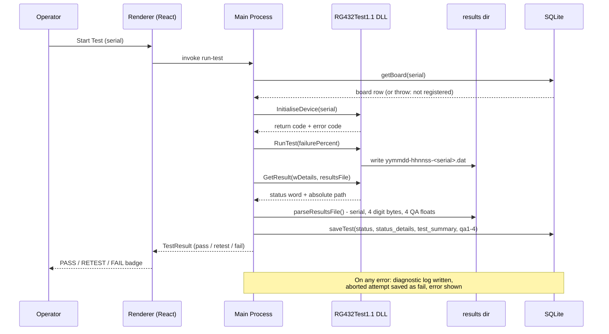

# RG432 Results File (.dat) Format & Processing

Documents the output file written by `RunTest` in `RG432Test1.1.dll`,
how the application locates and parses it, and how the parsed data is
linked to the SQLite test history. Based on the stage-2 reference guide
(`dll/RG432Test1.1.dll`, header `dll/RG432TestExports.h`) and Jeff's
`TestScheduleNotes.md`; the layout below was verified empirically by
calling the DLL through Koffi (`scripts/probe-dll.ts`), not just from
the documentation.

## 0. End-to-end flow

One click of Start Test runs this whole chain — the `.dat` file is the
hand-off point between the DLL's world and ours:



## 1. File creation

`RunTest(byType, byErrorCode)` writes a binary `.dat` file into the
results directory. The directory is configured through the Windows
registry key the DLL reads:

```
HKCU\SOFTWARE\LittleStone\432\TestSettings
  szPath (REG_SZ) = <results directory>
```

The application sets `szPath` to `userData/Results` on every board
registration (`ensureResultsPath` in `src/native/real-dll.ts`), so
results land alongside the SQLite database rather than in a fixed
system path.

`GetResult(wDetails, szResultsFile)` returns the absolute path of the
file the last `RunTest` wrote, so the app never has to guess the
filename. Filenames follow `yymmdd-hhnnss-<serial>.dat`.

`byType` carries the overall failure probability (0–100). The DLL
derives a lower per-test rate internally so the overall figure holds
across the four independent stages — the app passes the operator's
configured `failurePercent` setting straight through.

## 2. Binary layout — verified 276 bytes

Probed against real stage-2 output (a `failurePercent=0` pass and a
`failurePercent=100` guaranteed fail):

```
Offset          Size        Content
0               256 bytes   Serial number, ASCII, null-padded
256             4 bytes     Status digits — one byte per test, value 0-F
260             16 bytes    Four float32 LE QA values
```

A pass writes `00 00 00 00` at offset 256; a test-1 failure with
connexion fault produced `02 0f 0f 0f` — identical to the `wDetails`
word `0x2fff` returned by `GetResult` in the same run.

`parseResultsFile()` extracts the serial from the NUL-trimmed prefix,
reads the four digit bytes at `len-20`..`len-16`, and reads the QA
values as four little-endian float32s in the last 16 bytes.

## 3. Status word semantics

`wDetails` is a 4-digit hexadecimal status word — one digit per test
stage, most significant nibble = test 1.

| Digit | Meaning |
|:-----:|---------|
| `0` | Pass |
| `1` | Board not connected |
| `2` | Connexion faulty |
| `3` | Board not communicating |
| `4` | No output generated |
| `5` | No input detected |
| `6` | Maths error |
| `7` | Output waveform faulty |
| `8` | Input waveform faulty |
| `9` | Spectral distortion |
| `A`–`E` | Reserved (not produced) |
| `F` | Test skipped (a prior test already failed) |

Stages run in order and stop at the first failure — the remaining
stages read `F`, so only the first non-zero, non-`F` digit carries
meaning. Stage names (per Jeff): 1 input data acquisition, 2 output
data generation, 3 spectral tests, 4 algorithm accuracy.

### Pass / retest / fail classification

Per Jeff's response to `docs/open-questions-jeff.md`:

- `0x0000` → **pass**
- any digit `6`–`9` → **terminal fail** — the board has failed outright;
  the operator moves on to the next board
- any other response → **retryable fail** — a connexion-type fault; the
  UI shows "bad connexion" and keeps Start Test enabled for a retest

`isPassing()`, `isRetryable()` and `decodeStatus()` live in
`src/shared/status.ts` so the mock produces identical results.

## 4. Link to SQLite

Each test row stores the decoded outcome in dedicated columns (added by
migration 004), while `diagnostics` keeps the raw trace:

```
Details=0x2fff, summary="Test 1 (input data acquisition): connexion faulty",
qa=[-0.4616,0.5784,0.4317,1.151], file=C:\...\Results\<file>.dat
```

- `tests.status_details` — the raw word (`0x2fff`)
- `tests.test_summary` — the decoded first failure
- `tests.qa1`–`qa4` — the four QA floats, one column each
- `tests.diagnostics` — the full raw string for audit
- `tests.status` — `pass` or `fail` used by history and reports;
  retryable fails are still stored as `fail`

## 5. Failure handling

- Non-zero return or error codes from any DLL call throw immediately —
  the file is never read on a failed call.
- A missing/unreadable/short `.dat` file throws with the path in the
  message, so the diagnostic log shows which file failed.
- A `.dat` whose embedded serial doesn't match the board under test
  throws a mismatch error — guards against a stale file from a previous
  run.
- All failures surface through the IPC layer to the operator UI and are
  written to `userData/logs/` by the diagnostics logger; the aborted
  attempt is still recorded as a `fail` row for traceability.

## 6. Notes for the physical tester

The stage-2 DLL still simulates fault injection — `byType` exists to
exercise the failure-handling paths and will serve no purpose on the
real tester (Jeff's words). The parsing, decoding and persistence paths
built here carry over unchanged; if the final board produces a
different digit vocabulary or `.dat` layout, `src/shared/status.ts` and
`parseResultsFile()` are the two points to update.
