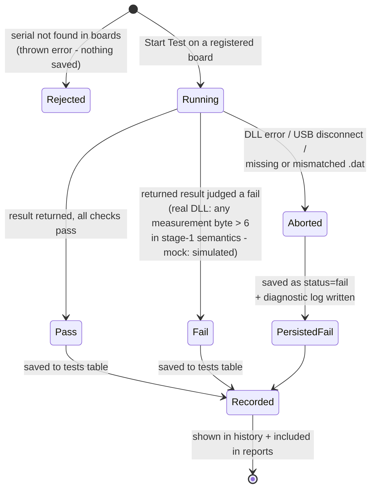

# Testing Strategy

The test types this project uses, what each one covers, and where the
evidence lives. Not every test type suits a single-screen desktop tool — the
table says which apply and why.

## Test types

| Type | Applies? | What we do | Evidence |
|---|---|---|---|
| **Unit** | Yes | Pure functions tested in isolation: report aggregation, CSV building, serial validation, `.dat` parsing, repository queries against in-memory SQLite | `tests/` — 39 tests via Vitest (`npm test`) |
| **Integration** | Yes | `run-test` flow exercised end to end: registration → DLL/mock → `.dat` → SQLite. The real-DLL suite runs against the actual `RG432Test1.0.dll` through Koffi (skipped in CI where `dll/` is gitignored) | `tests/integration.test.ts`, `tests/real-dll.integration.test.ts` |
| **System** | Yes | Installed-app smoke test: install the NSIS package on a Windows PC, register, run real and mock tests, export, restart persistence | Sprint 4 Week 2 install verification; `docs/uat/uat-scripts.md` UAT-01/07 |
| **User Acceptance** | Yes | Given/When/Then scripts derived from the use cases, run by Jeff for sign-off | `docs/uat/uat-scripts.md` (UAT-01–10) |
| **Security** | Partially | Parameterised queries (injection), sandboxed + context-isolated renderer with an allowlisted IPC bridge, strict `script-src 'self'` CSP (inline styles are permitted for Tailwind/React inline styles), inputs validated at the IPC boundary | Security checklist (`AGILE_SDLC_STRATEGY.md`); `src/main/index.ts` handlers; `src/shared/validation.ts` |
| **Performance** | Partially | Not a measurable concern at this scale — but `tests.board_id` is indexed (migration 003) and mock timing mirrors the real DLL (3s registration, ~4s test) so the UI is exercised under realistic waits | `docs/database/design-notes.md` indexing section |
| **Non-functional** | Partially | Usability: unmissable PASS/FAIL badge, dark/light themes, inline validation hints. Reliability: aborted tests still recorded as fails so no attempt goes untracked | `docs/requirements/wireframe.md`; `src/main/index.ts` run-test handler |
| **Regression** | Yes | Every PR runs lint + typecheck + the full suite in GitHub Actions; squash-merge keeps `main` releasable | `.github/workflows/ci.yml` |

## What "partially" means

Security, performance and non-functional testing are scoped to what a
single-user offline desktop app can meaningfully have: there is no network
surface to pen-test, no load to benchmark, no server to harden. The coverage
is deliberate, not absent — the risk register records what was deferred and
why (code signing, shared-PC access control).

## Test lifecycle

The states a single test can move through, and what each transition
persisted:



Three exit routes, one guarantee: **every completed test attempt leaves a
row**. A rejected request never produces a row (no test happened), but an
aborted test does — an operator who watched a test die mid-run can point at
its record and its diagnostic log. The `pending` status exists in the schema
CHECK constraint for a future queued-test feature but is never written today.

## Running the suite

```powershell
npm test          # all tests (rebuilds better-sqlite3 for Node first)
npm run lint      # ESLint
npm run type-check
```

Native-module note: stop the Electron dev app before `npm test` — both
rebuild `better_sqlite3.node` and Windows locks the file while the app holds
it open.
