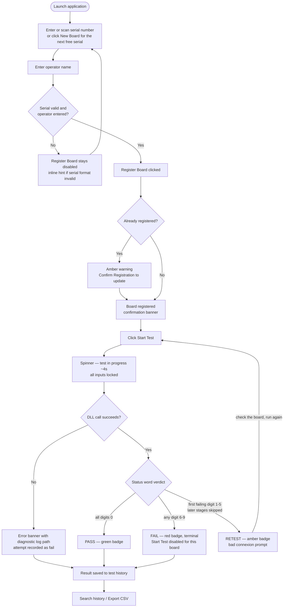

# Operator Workflow — RG432 Test Rig

End-to-end flow for registering a board and running a test, built from
`docs/requirements/use-cases.md` (Use Cases 1–4) and the implemented
behaviour in `src/renderer/App.tsx` and `src/shared/status.ts`.

## Notes

- The retest loop is Jeff's rule: status digits 6–9 are terminal faults,
  anything else is a connexion-type fault the operator may retry
  immediately (`isRetryable` in `src/shared/status.ts`).
- A board is "done" after a pass or a terminal fail — Start Test
  disables until a new serial is entered (`boardDone` in `App.tsx`).
- A failed DLL call still lands in history as a fail with the diagnostic
  log path, so no test attempt is ever untracked (Use Case 2
  alternative 4a).
